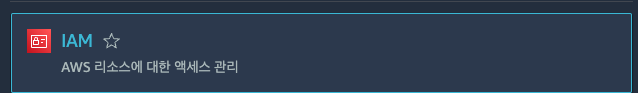

# aws-cli로 lambda ( Java ) 배포하기

## 준비물

- aws-cli : cli를 이용해서 aws와 통신
- IAM user : lambda 생성권한을 가지고 있는 계정
- S3 버킷 : 람다 함수를 보관할 저장소
- maven : 람다 함수를 작성할 프로젝트 빌더

## aws-cli 설정하기

### IAM User 생성

1. [AWS console](https://us-east-1.console.aws.amazon.com/console/home) 에 접속
  
2. IAM ( Identity and Access Management ) 서비스로 이동
  
3. 엑세스 관리 > 사용자 > 사용자 추가
  
4. 사용자 이름 - lambda-create-user, 엑세스 키 - 프로그래밍 방식 엑세스 체크
  
5. 권한설정 ( 기존 정책 직접 연결 ) - AWSLambda-FullAccess, AmazonS3FullAccess 추가
  
6. 검토 후 사용자 만들기 ( * .csv 다운로드 필수 ! && 공유 절대 금지)
  

### aws-cli에 IAM user 연동하기

```bash
aws config
```

## s3 버킷 생성하기

## maven으로 프로젝트 생성하기

## cli로 배포하기

to learn lambda written java lang

```bash
mvn build

aws s3 cp ./target/demo-1.0.0.jar s3://hello-lambda-5318

aws lambda create-function --function-name hello-function-001 --role arn:aws:iam::006225811947:role/hello-lambda-role --runtime java11 --handler com.amazonaws.lambda.demo.HelloLambda::handleRequest --code S3Bucket=hello-lambda-5318,S3Key=demo-1.0.0.jar

aws lambda update-function-code --function-name hello-lambda-function \
 --s3-bucket hello-lambda-5318 --s3-key demo-1.0.0.jar
```
