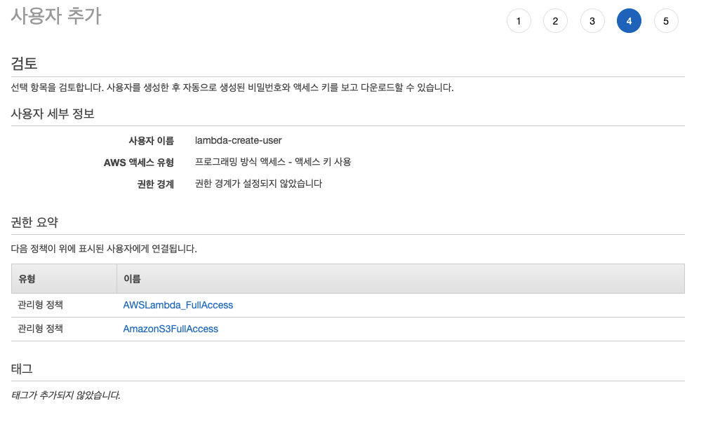

# AWS CLI로 lambda ( Java ) 배포하기

- Eclipse Toolkit을 이용한 배포를 권장하지만, 최신 Eclipse 버전 ( 2021 이후 버전 )에서는 지원이 안되는 이슈가 있습니다.
- 특정 Eclipse버전 에서는 java 11 버전을 지원하지 않는 등의 이슈가 끊이질 않기 때문에
- Toolkit을 이용하는 것보다 직접 cli를 사용해서 배포하는 것이 정신건강에 도움이 많이 됩니다.

## 목차

- [AWS CLI로 lambda ( Java ) 배포하기](#aws-cli로-lambda--java--배포하기)
  - [목차](#목차)
  - [준비물](#준비물)
  - [aws-cli 설정하기](#aws-cli-설정하기)
    - [IAM User 생성 ( * .csv 저장 필수 ! )](#iam-user-생성---csv-저장-필수--)
    - [aws-cli 설치](#aws-cli-설치)
      - [Mac & Linux](#mac--linux)
      - [Windows](#windows)
    - [aws-cli에 IAM user 연동하기](#aws-cli에-iam-user-연동하기)
  - [S3 버킷 생성하기 ( * 버킷 이름 기록 !)](#s3-버킷-생성하기---버킷-이름-기록-)
    - [AWS Console로 버킷 생성](#aws-console로-버킷-생성)
    - [aws-cli로 버킷 생성](#aws-cli로-버킷-생성)
  - [maven으로 프로젝트 생성하기](#maven으로-프로젝트-생성하기)
    - [IAM Role 생성 ( * ARN 기억 )](#iam-role-생성---arn-기억-)
    - [maven cli 로 프로젝트 시작하기](#maven-cli-로-프로젝트-시작하기)
    - [Java의 샘플 Lambda 애플리케이션fh 시작하기](#java의-샘플-lambda-애플리케이션fh-시작하기)
    - [Maven 빌드하기 ( * .jar 파일 생성 )](#maven-빌드하기---jar-파일-생성-)
  - [AWS CLI로 람다 파일 배포하기](#aws-cli로-람다-파일-배포하기)
    - [S3 버킷 ( hello-lambda-8376 )에 .jar파일 올리기](#s3-버킷--hello-lambda-8376-에-jar파일-올리기)
      - [올라간 hello-lambda.jar 파일 확인하기](#올라간-hello-lambdajar-파일-확인하기)
    - [Lambda 함수 배포하기](#lambda-함수-배포하기)
      - [hello-lambda 배포 확인하기](#hello-lambda-배포-확인하기)

## 준비물

- AWS CLI ( aws와 통신 )
- IAM User ( lambda 생성/수정 권한을 가지고 있는 계정 )
- IAM Role ( lambda 함수가 가지는 권한 )
- S3 버킷  ( 람다 함수 .jar 파일을 보관할 저장소 )
- Apache Maven  ( 람다 함수를 작성할 프로젝트 빌더 )
- Java ( 11 버전 )

## aws-cli 설정하기

- [AWS 명령줄 인터페이스](https://aws.amazon.com/ko/cli/) - 로컬 컴퓨터와 AWS 와 인터페이스를 연결하여 명령줄로 람다 생성/수정을 가능하도록 함
- 루트 계정의 엑세스키는 매우 위험하므로 람다 생성을 위한 최소권한을 가진 IAM User를 생성하여 aws-cli와 연결

### IAM User 생성 ( * .csv 저장 필수 ! )

1. [AWS console](https://us-east-1.console.aws.amazon.com/console/home) 에 접속
2. IAM ( Identity and Access Management ) 서비스로 이동
3. 엑세스 관리 > 사용자 > 사용자 추가
  
4. 사용자 이름 - lambda-create-user, 엑세스 키 - 프로그래밍 방식 엑세스 체크
  
5. 권한설정 ( 기존 정책 직접 연결 ) - AWSLambda-FullAccess, AmazonS3FullAccess 추가
  <!--  -->
6. 검토 후 사용자 만들기 ( * .csv 다운로드 필수 ! && 공유 절대 금지)
  
  

### aws-cli 설치

- [AWS 명령줄 인터페이스 설명서](https://aws.amazon.com/ko/cli/)

#### Mac & Linux

```bash
# Python 2.6.5 이상이 필요합니다.
# pip를 사용하여 설치합니다.

pip install awscli # 설치
aws help           # 테스트
```

#### Windows

[64비트](https://s3.amazonaws.com/aws-cli/AWSCLI64.msi) 또는 [32비트](https://s3.amazonaws.com/aws-cli/AWSCLI32.msi) Windows 설치 프로그램을 다운로드해서 실행합니다.

### aws-cli에 IAM user 연동하기

- aws config 명령어를 이용하여, IAM User를 생성하면서 받은 엑세스 ID/키를 입력합니다 ( .csv 파일 참조 )
- 리전은 ( ap-northeast-2 ) 서울리전으로 지정합니다.

```bash
aws configure
```


## S3 버킷 생성하기 ( * 버킷 이름 기록 !)

- 람다 함수 .jar 파일을 보관할 저장소로 쓰일 S3 버킷을 생성한다\
- 아래 방법중 한가지를 선택해서 버킷을 생성한다

### AWS Console로 버킷 생성

1. [AWS console](https://us-east-1.console.aws.amazon.com/console/home) > S3 > 버킷
2. S3 "버킷 만들기"
  
3. 버킷 이름 - hello-lambda-xxxx (xxxx에는 고유한 숫자 기입), AWS 리전 - 서울 ( * 버킷 이름 기록 !)
  

### aws-cli로 버킷 생성

- xxxx에는 고유한 숫자 기입 | * 버킷 이름 기록 !
- 서울리전
- 서울리전에서만 이용가능하도록 제약
- 본인만 사용가능하도록 소유권 설정

```bash
aws s3api create-bucket \
    --bucket hello-lambda-xxxx \
    --region ap-northeast-2 \
    --create-bucket-configuration LocationConstraint=ap-northeast-2 \
    --object-ownership BucketOwnerEnforced
```


- 생성된 버킷 확인


## maven으로 프로젝트 생성하기

- [maven 설치](https://maven.apache.org/download.cgi)

```bash
mvn -version # 설치 확인
```

### IAM Role 생성 ( * ARN 기억 )

- 개발하기 앞서 람다함수가 사용할 IAM Role을 생성합니다.
- 람다 함수가 어떤 일을 수행하느냐에 따라서 필요한 Role이 다릅니다.
- S3 를 이용하한 람다라면 S3 권한이, DynamoDB를 이용한 람다라면 DynamoDB 접근권한이 필요합니다.
- 기본적으로 모니터링을 위해 CloudWatch 권한은 필수적으로 들어갑니다.

1. [AWS console](https://us-east-1.console.aws.amazon.com/console/home) 에 접속
2. IAM > 액세스 관리 > 역할 > "역할 만들기"
  
3. 신뢰할 수 있는 엔터티 선택 | 유형 - AWS 서비스, 사용사례 - Lambda
  
4. 권한 추가 | AWSLambdaBasicExecutionRole 선택 ( Lambda가 가질 수 있는 가장 기본적인 권한 )
  
5. 이름 지정, 검토 및 생성 | 이름 - lambda-basic-role
  
6. 생성된 role의 ARN 저장
  


### maven cli 로 프로젝트 시작하기

```bash
mvn archetype:generate \
    -DarchetypeGroupId=software.amazon.awssdk \
    -DarchetypeArtifactId=archetype-lambda \
    -DarchetypeVersion=2.15.79 \
    -DgroupId=com.amazon.test \
    -DartifactId=hello-lambda \
    -Dservice=s3  \
    -Dregion=ap-northeast-2 \
    -DinteractiveMode=false
```

### Java의 샘플 Lambda 애플리케이션fh 시작하기

Java의 샘플 Lambda 애플리케이션

[blank-java](https://github.com/awsdocs/aws-lambda-developer-guide/tree/main/sample-apps/blank-java) – Lambda의 Java 라이브러리, 로깅, 환경 변수, 계층, AWS X-Ray 추적, 단위 테스트 및 AWS SDK를 사용하는 방법을 보여주는 Java 함수입니다.

[java-basic](https://github.com/awsdocs/aws-lambda-developer-guide/tree/main/sample-apps/java-basic) – 단위 테스트 및 변수 로깅 구성을 사용하는 최소한의 Java 함수입니다.

[java-events](https://github.com/awsdocs/aws-lambda-developer-guide/tree/main/sample-apps/java-events) – 최신 버전(3.0.0 이상)의 aws-lambda-java-events 라이브러리를 사용하는 최소한의 Java 함수입니다. 이러한 예는 AWS SDK를 종속 항목으로 요구하지 않습니다.

[s3-java](https://github.com/awsdocs/aws-lambda-developer-guide/tree/main/sample-apps/s3-java)– Amazon S3의 알림 이벤트를 처리하고 JCL(Java Class Library)을 사용하여 업로드된 이미지 파일의 썸네일을 생성하는 Java 함수입니다.

### Maven 빌드하기 ( * .jar 파일 생성 )

```bash
cd /hello-lambda
mvn install
```

- target 폴더안에 hello-lambda.jar 파일 생성 확인

## AWS CLI로 람다 파일 배포하기

### S3 버킷 ( hello-lambda-8376 )에 .jar파일 올리기

```bash
aws s3 cp ./target/hello-lambda.jar s3://hello-lambda-8376 # cp - 로컬 파일을 버킷으로 복사
```

#### 올라간 hello-lambda.jar 파일 확인하기


### Lambda 함수 배포하기

- 생성할 Lambda 함수의 이름
- 생성했던 Roledml ARN ( Amazon Resource Name )
- Runtime - Java 11
- handleRequest 함수 위치 파악 ( 패키지 명과 클리스 확인 필수 )
- hello-lambda-8376 버킷에서 hello-lambda.jar 파일 연결

```bash
aws lambda create-function \
--function-name hello-lambda-002 \
--role arn:aws:iam::006225811947:role/lambda-basic-role \
--runtime java11 \
--handler com.amazon.test.App::handleRequest \
--code S3Bucket=hello-lambda-8376,S3Key=hello-lambda.jar
```


#### hello-lambda 배포 확인하기


